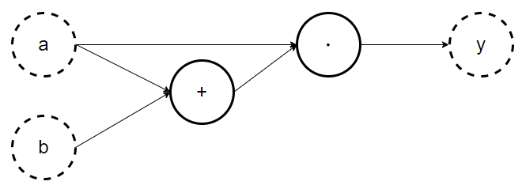
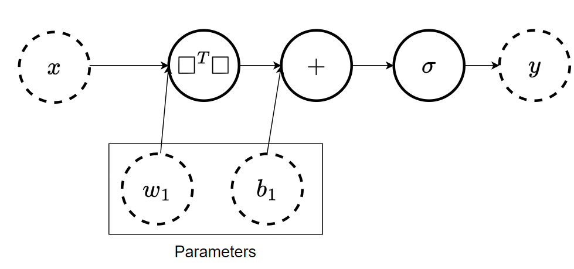
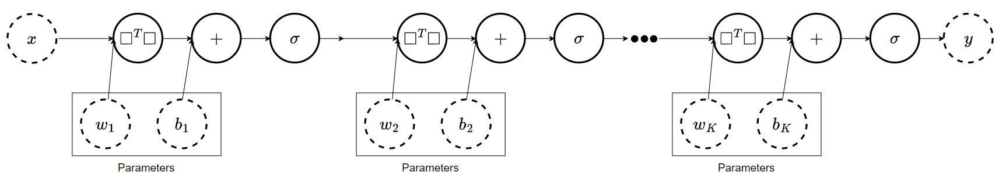
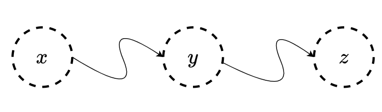
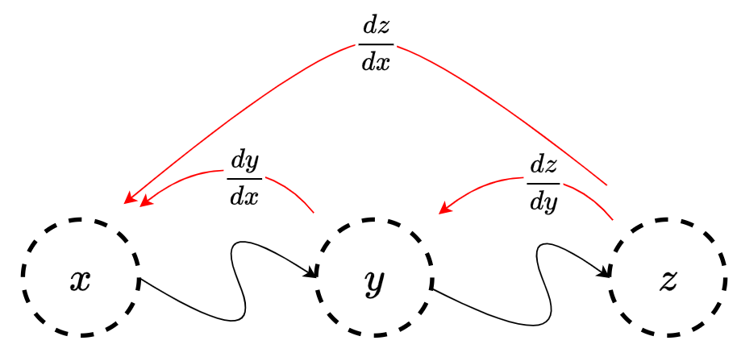
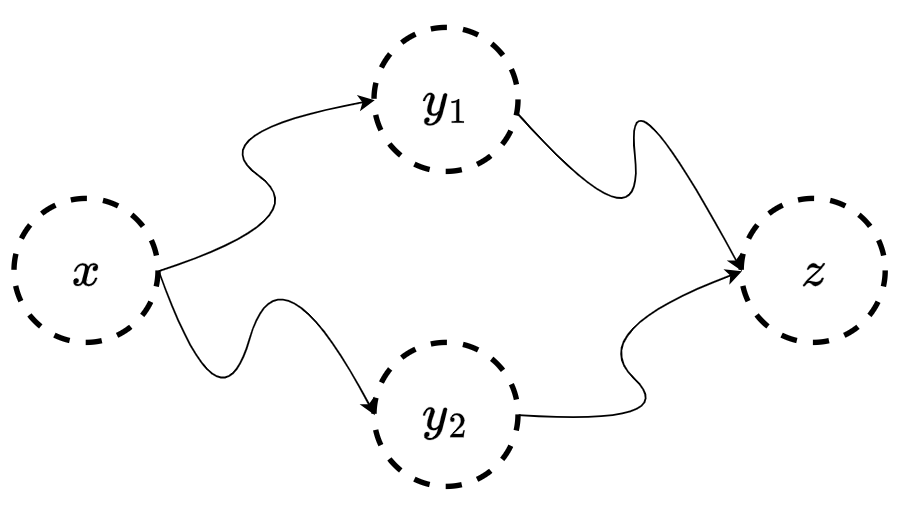
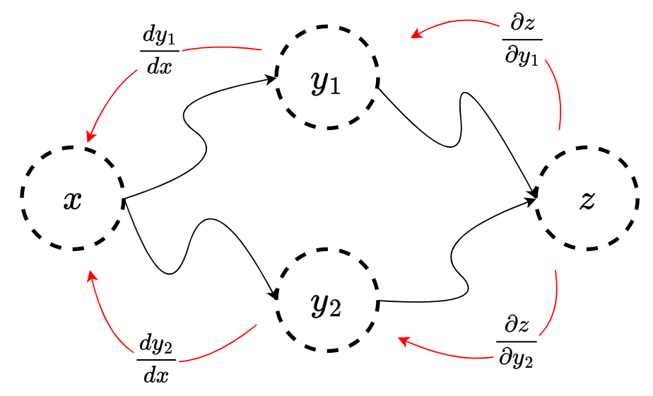
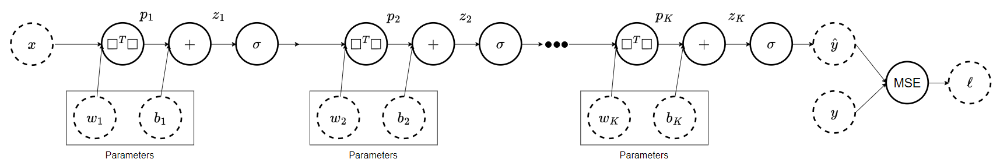

# Motivation
Optimization is the process of searching for the best element. It is not clear yet what "best" men or what "element" is, we will come to this later.
We optimize daily, sometimes without even realizing it. Here are a few examples:

1. <u>Route Optimization</u>: When planning our day, we often search for the best route - the one that will minimize the time we waste or the distance we cover. The app Waze for example, tries to find the fastest route for us.
2. <u>Meal Planning</u>: When preparing a meal, we might want to maximize the nutritional value of the meal and tastiness while minimizing the cost and time spent. This could involve pretty complex factors.
3. <u>Storage</u>: When organizing our belongings at home, some of us will shove everything into a closet never to open it again, but some of us will order the closet to minimize the taken space and maximize the accessibility. 
When taking optimization seriously, we can create stronger materials, more efficient hardware,  more environment-friendly cars, etc.
So optimization is a big deal, but let's try to understand how it works and how it connects to deep learning.
# Optimization Ingredients
The optimization process can be composed into two main parts:
1. <u>The optimization problem</u> which defines:
	* What does it mean to be "better"? 
	* What "elements" are possible solutions?
2. <u> The optimization algorithm</u> which defines:
	* How do we search for a solution?

Before diving into the math, let's look at some examples.
In the problem of route optimization, assuming we want to minimize the time it takes us, a possible solution is a route and a better route is one that takes less time. So now the problem is better defined - find a route that takes the least time.
The optimization algorithm is then how we search for such a route. Naively, this can be done by going over each route, calculating the time it takes, and then choosing the best one. When we have many routes, this will be a very long process (If Waze were to do this, none of us would use it).
## Mathematical Formulation
How do we define the optimization problem mathematically?
We first define some set of possible solutions $W$. This set can be the set of all possible routes or the set of all possible points in 2D.
Then we define a score that determines how good a candidate solution is. This score is a function:

$$
	L \colon W \to \mathbb{R}
$$

For example, this can be the time it takes for a given route. We now want to minimize this function, which in machine learning is usually called the loss function (or sometimes the risk function).
We write the entire optimization problem as a minimization:

$$
	w^* = \underset{w \in W}{\arg\min} \, L(w)
$$

(If we want to maximize $L$ we can instead minimize $-L$)

Here is a concrete example we know from high school:
Find the minimum of the parabola $f(w) = w^2 + 1$
In this case, the set of possible solutions is $W = \mathbb{R}$, and the loss function is simply the given parabola $L(w) = w^2 + 1$.
In this case, it is easy to see the best solution (the one with minimal $L$ value) is $w^* = 0$ - this is called the <u>optimal solution</u>, and the value of this solution $L(w^*) = 0^2 + 1 = 1$ is called the <u>optimal value</u>.
Note that it is possible to have multiple optimal solutions, but only one optimal value! You can try and think of such examples.

So now that we have a loss function $L$ to minimize and a set $W$ of possible solution, all we are left with is the optimization algorithm.
In the example of the parabola, we learned an algorithm in high school:
1. Calculate the derivative $L'(w)$
2. Find an $w \in W$ that satisfy $L'(w) = 0$
This simple algorithm indeed solved this problem, but it won't always work. Here are a few examples:
* What if we restrict our solutions set, like $W = \left\{ w \in \mathbb{R} \mid w > 1 \right\}$?
  In this case, the algorithm we had won't find any solution (no $x \in X$ satisfies $L'(w) = 0$)
* What if our function is a little bit more complex, like $L(w) = w^4 + 2w^3$?
  In this case, the algorithm will give us two solutions: $w^*_1 = -\frac{3}{2}$ and $w^*_2 = 0$, but only one of them achieves the optimal solution.
* What if our function is not even differentiable, like $L(w) = |w|$?
  In this case, the derivative is not even defined (especially where the solution is).

We can try to improve our algorithm to solve such cases, but we don't have an algorithm that solves any optimization problem...
Therefore, we will focus on the most common case in deep learning: The differentiable case.
Simply put, we assume $L$ is differentiable. This solves the last case (solution by ignoring), but it does not solve the second case.
We don't know (at least not yet) how to minimize a general differentiable function. Instead, we are going to use an algorithm that will find a good solution, not necessarily the best one.

### The Case of Deep Learning
In the previous lesson we saw that the MLP is essentially a function of the input and the weights of the network, we will denote this as:

$$
	F(x;w)
$$
which is a function of the input $x$ parameterized by the weights $w$.
In this case, we want to find the best weights $w$ that will minimize our error.
This means the set of possible solutions is the set of possible weights, or equivalently, the set of functions that are parameterized by those weights.

In supervised learning, our loss function is usually of the form:

$$
	L(w) = \underset{(x, y)}{\mathbb{E}} \ell \left( F(x; w), \, y \right)
$$

The function $\ell(\hat{y}, y)$ is the loss for a single prediction.
So the total error $L(w)$ is basically the average of $\ell$ over all samples.

For example, assume we want to classify images of dogs and cats ($x$ being an image and $y$ being the class).  This can be done using the $0-1$ loss:

$$
	\ell(\hat{y}, y) = 
		\begin{cases}
			1 &\hat{y} \ne y \\
			0 &\hat{y} = y
		\end{cases}
$$

The loss is $1$ if you are wrong, and $0$ if you are correct.
This loss captures exactly what we want, but it is too strict - it only says right or wrong and not "more right" or "more wrong" which allows for easier optimization. 
Another option is the $L_2$ loss:

$$
	\ell(\hat{y}, y) = \left( \hat{y} - y \right)^2
$$

So a greater deviance between the prediction and the true label will result in greater loss. This gives some smoother notion of wrong, if you are wrong by a lot it is different than being wrong by a little.

There are many different loss functions, each one has its own benefits and its own use cases. It is important to choose a good loss function that will fit your needs.

In practice, since we don't have all of the samples but only a finite dataset $S = \{ (x_1, y_1), \dots, (x_N, y_N) \}$ we approximate the loss using an average:

$$
	\hat{L}(w) = \frac{1}{N} \sum_{i=1}^{N} \ell(F(x_i; w), \, y_i)
$$

# Gradient Descent (GD)
Gradient descent is the basic algorithm that allows us to optimize any differentiable function (to find a good solution, not necessarily the best).
The algorithm runs in iterations, in each iteration we find a direction in $W$ that moving along this direction will lower our loss, and we move there.
The gradient (a multi-dimensional derivative) gives us the direction of the steepest descent.
<b>Note</b>: If you don't know what a gradient is, don't worry, for now, all you need to know is that it gives us a direction for lowering the loss.

%TODO: Add GD animation%

The algorithm:
<b>Input:</b>
	initial weights $w_0$
	step size $\eta > 0$ 
	Number of iterations T
<b>Output</b>:
	a good solution $w_T$ 
In each iteration $k \in \{1, \dots, T\}$:

$$
	w_{k} = w_{k - 1} - \eta \nabla L(w_{k-1})
$$

Finally, return $w_T$

In each iteration, the algorithm updates the current weights using a small step (of size $\eta$) in the direction of the gradient $\nabla L$.

This algorithm does not ensure we will end in the best possible solution (even if we run infinitely many iterations), but for an appropriate step size $\eta$ one can prove that the algorithm converges to a local minimum.
This means that the initial weights $w_0$ and the step size $\eta$ can have a great impact on the final weights, and thereby on the quality of the solution.
To overcome this challenge, you can run the algorithm multiple times using different initial weights or different step sizes and choose the best result overall.

The main challenge we are left with is calculating the gradient for our loss.

A great video by 3Blue1Brown explains this algorithm with great animations:

# Backpropagation
Backpropagation is the algorithm that allows us to calculate the gradient of a general neural network efficiently. This algorithm heavily relies on the chain rule for derivatives, so we will have a short reminder, but first, we need to think about how the network is represented from a computational point of view.

<b>Note</b>: Before we dive into the mathematical formulation of this algorithm, you can watch the video by 3Blue1Brown to get some intuition:

## Computational Graph
Once again there is a great video by 3Blue1Brown about computational graphs and the chain rule. You can watch this video to get the intuition (and even some math!) before reading the full math we need here:

We need to represent the neural networks for the computer to be able to calculate them. For this, we use computational graphs. A computational graph is a directed graph that describes a function.
The nodes of the graph are mathematical operations (addition, multiplication, etc.) or variables (scalars, vectors, etc.) and the edges describe the order of the operations. Here are a few examples:

If we want to create the graph of the function $y = a \cdot (a + b)$ we use the graph:

When we want to calculate the value of the function for specific values of $a, b$ we plug those values in and propagate them forward in the graph.
If we set $a = 3$ and $b = 4$, the graph will tell us to calculate the sum $3 + 4 = 7$, then take the result and multiply it by $3$ to give $3 \cdot 7 = 21$, then take the result and plug it into $y$. So indeed we get $y = 3 \cdot (3 + 4)$ = 21.

In the previous lesson, we saw the basic building block, the Perceptron, as a computational graph:
The function $f(x; w, b) = w^Tx + b$ is represented using the graph:

Note that the parameters are just part of the graph, like any other variable.
If we want to represent an MLP, we just stack several of these one after the other:

Now that we know how to build the network as a graph, and we know how to calculate the output using forward propagation, we are left with the problem of calculating the gradient of the network.
## Chain Rule and Univariate Backpropagation
for a univariate function $z(x)$ we denote the derivative of the function with respect to its input $x$ as $\frac{dz}{dx}$.
In the case we have some composition of functions we can use the chain rule:

$$
	\frac{dz}{dx} = \frac{dz}{dy} \cdot \frac{dy}{dx}
$$

Let's look at this from a computational graph point of view:

Where the squiggly lines denote some arbitrary functions (maybe with more variables).
Then, what the chain rule is telling us, is that to calculate the derivative of $z$ with respect to $x$ we can go back from $z$, calculate its derivative with respect to $y$, and then multiply it by the derivative of $y$ with respect to $x$ - so we propagate the derivative from the end of the graph all the way to its start.

So as long as $z$ "knows" how to calculate its derivative with respect to $y$, it shouldn't care what happened before $y$.

Here is a concrete example:

$$
	z = \sin(x^3)
$$

we can denote $y = x^3$ and use the chain rule:

$$
	\frac{dz}{dx} = \frac{dz}{dy} \cdot \frac{dy}{dx} = \cos(y) \cdot 3x^2 = \cos(x^3) \cdot 3x^2
$$

Moreover, if we want to calculate the derivate at a specific value, say $x = x_0$ the chain rule becomes:

$$
	\left. \frac{dz}{dx} \right|_{x_0} = \left. \frac{dz}{dy} \right|_{y(x_0)} \cdot \left. \frac{dy}{dx} \right|_{x_0}
$$

And in our example, if we want to calculate the derivate at $x_0 = 2$:

$$
	\left. \frac{dz}{dx} \right|_{x_0} = \left. \frac{dz}{dy} \right|_{y(x_0)} \cdot \left. \frac{dy}{dx} \right|_{x_0} = \cos(y(2)) \cdot \left. \frac{dy}{dx} \right|_{x_0} = \cos(y(2)) \cdot 3 \cdot (2)^2 = \cos(8) \cdot 3 \cdot 2^2
$$

To achieve this using our graph we first propagate the graph forward after we set $x = 2$, then when the nodes hold the values they calculated we can propagate backward the derivate, in each node we simply multiply the derivate we have so far with the derivative of the current node.

What happens when we have multiple branches? Let's look at the following graph:

Here $z$ is a function of both $y_1, y_2$ and each of them is a function of $x$.
In this case, the chain rule is:

$$
	\frac{dz}{dx} = \frac{\partial z}{\partial y_1} \cdot \frac{dy_1}{dx} + \frac{\partial z}{\partial y_2} \cdot \frac{dy_2}{dx}
$$

The scribbled d: $\partial$ means we calculate the derivative while acting as if all other variables are constants (so $\frac{\partial z}{\partial y_1}$ is calculated as if $x, y_2$ were constants)
.
We can think of this as calculating the derivative of each arrow individually, and then combining them:

To combine we follow a simple rule:
* If we have a split, we add the derivative of each branch.
* If we have an intermediate variable we multiply the derivatives.

For a final example:

$$
	\begin{aligned}
		y_1 &= x^2 \\
		y_2 &= \sin(x) \\
		z &= y_1 \cdot y_2
	\end{aligned}
$$

We can calculate each step individually:

$$
	\begin{aligned}
		\frac{\partial z}{\partial y_1} &= y_2  & \frac{dy_1}{dx} &= 2x \\
		\frac{\partial z}{\partial y_2} &= y_1 & \frac{dy_2}{dx} &= \cos(x)\\
	\end{aligned}
$$

And aggregate them according to the graph:

$$
	\frac{dz}{dx} = y_2 \cdot 2x + y_1 \cdot \cos(x) = \sin(x) \cdot 2x + x^2 \cdot \cos(x)
$$

Note that in each step we act as if all other variables are just constants.
When we differentiate $z$ with respect to $y_1$, we act as if $y_2$ is just a constant.
## Gradient and Jacobian
When using neural networks, the functions we derive are not just one-dimensional functions $f \colon \mathbb{R} \to \mathbb{R}$ but instead they are commonly multi-dimensional functions, like $f \colon \mathbb{R}^n \to \mathbb{R}$ or even $f \colon \mathbb{R}^n \to \mathbb{R}^m$.
There are more general cases (like $f \colon \mathbb{R}^{n_1 \times n_2} \to \mathbb{R}^{m_1 \times m_2 \times m_3}$), but the generalizations are fairly straightforward once you understand the cases we will see here.

We will start with a detour to get familiar with multivariate derivatives and then see how the chain rule applies in those cases.
If you are already familiar with gradients and Jacobians, feel free to skip ahead.
### Gradient: Derivatives for $f \colon \mathbb{R}^n \to \mathbb{R}$
These functions take a vector (multiple inputs) as an input and output a scalar. Here are a few examples:

$$
	\begin{aligned}
		y(x_1, x_2) &= x_1 + x_2 \\
		g_w(x) &= w^Tx = \sum_{i=1}^{n} w_i \cdot x_i \\
		h_A(x) &= x^T A x = \sum_{i=1}^{n} \sum_{j=1}^{m} a_{i, j} \cdot x_i \cdot x_j
	\end{aligned}
$$

Where $w \in \mathbb{R}^n$ for $g_w$ is some vector and $A \in \mathbb{R}^{n \times n}$ is a matrix.
The inner product for example is used in many deep neural networks (like the Perceptron).

To calculate the derivatives of these multidimensional functions we use the gradient.
The gradient calculates the derivative of the output with respect to each input:

$$
	\nabla f = \begin{bmatrix}
		\frac{\partial f}{\partial x_1} \\
		\vdots \\
		\frac{\partial f}{\partial x_n}
	\end{bmatrix}
$$

Let's look at how we can calculate the gradient for the examples above:

$$
	\nabla y = \begin{bmatrix}
		\frac{\partial y}{\partial x_1} \\
		\frac{\partial f}{\partial x_2}
	\end{bmatrix}
	= \begin{bmatrix}
		1 \\
		1
	\end{bmatrix}
$$

since deriving $y$ with respect to $x_1$ while acting as if $y_2$ is a constant gives us $1$.
Likewise,

$$
	\frac{\partial g_w}{\partial x_i} = w_i
$$

Therefore,

$$
	\nabla g_w = \begin{bmatrix}
		\frac{\partial g_w}{\partial x_1} \\
		\vdots \\
		\frac{\partial g_w}{\partial x_n}
	\end{bmatrix}
	= \begin{bmatrix}
		w_1 \\
		\vdots \\
		w_n
	\end{bmatrix}
	= w
$$

And finally,

$$
	\frac{\partial h_A}{\partial x_k} = \frac{\partial}{\partial x_k} \sum_{i=1}^{n} \sum_{j=1}^{m} a_{i, j} \cdot x_i \cdot x_j = \sum_{i=1}^{n} \sum_{j=1}^{m} \frac{\partial}{\partial x_k} a_{i, j} \cdot x_i \cdot x_j
$$

If $k \ne i$ and $k \ne j$, then the derivative is 0.
If $k = i$ but $k \ne j$, then the derivative is $x_j \cdot a_{k, j}$.
If $k \ne i$ but $k = j$, then similarly the derivative is $x_i \cdot a_{i, k}$.
And if $k = i = j$, then we need to derive $a_{k, k} \cdot x_k^2$ which gives $2 a_{k, k} \cdot x_k$.
Combining these:

$$
	\frac{\partial h_A}{\partial x_k} = \sum_{i \ne k} x_i \cdot a_{i, k} + \sum_{j \ne k} x_j \cdot a_{k, j} + 2 a_{k, k} x_k
$$

Which can be rewritten as:

$$
	= \sum_{i=1}^{n} x_i \cdot a_{i, k} + \sum_{j=1}^{n} x_j \cdot a_{k, j} 
$$

If we denote the $k^{\text{th}}$ row of $A$ as $A_{k, :}$ and the $k^{\text{th}}$ column of $A$ as $A_{:, k}$ then we get:

$$
	= A_{:, k} ^T x + A_{k, :} ^T x = (A_{:, k} + A_{k, :})^T x = \left(A_{:, k} + (A^T)_{: k} \right)^T x = \left( (A + A^T)_{:, k} \right)^T x
$$

Which gives:

$$
	\nabla h_A = \begin{bmatrix}
		\frac{\partial h_A}{\partial x_1} \\
		\vdots \\
		\frac{\partial h_A}{\partial x_n}
	\end{bmatrix}
	= \begin{bmatrix}
		\left( (A + A^T)_{:, 1} \right)^T x \\
		\vdots \\
		\left( (A + A^T)_{:, n} \right)^T x
	\end{bmatrix}
	= \begin{bmatrix}
		(A + A^T)_{:, 1}^T \\
		\vdots \\
		(A + A^T)_{:, n}^T
	\end{bmatrix} x
	= (A + A^T) x
$$

(Highly recommended to draw this and play with it if something isn't clear)

### Jacobian: Derivative for $f \colon \mathbb{R}^n \to \mathbb{R}^m$
These functions take a vector as input and return another vector as output (possibly with a different dimension).
These functions include the hidden layers of the MLP and many more.

Here are some examples of these types of functions:

$$
	\begin{aligned}
		y((u, v)) &= u + v \quad \text{for} \; u, v \in \mathbb{R}^n \\
		h_A(x) &= Ax \quad \text{for} \; A \in \mathbb{R}^{m \times n}
	\end{aligned}
$$

The trick for deriving the Jacobian is to look at the function $f \colon \mathbb{R}^n \to \mathbb{R}^m$ as a tuple of functions $(f_1, \dots f_m)$ with each of them being $f_i \colon \mathbb{R}^n \to \mathbb{R}$.
The Jacobian calculates the derivative of each output with respect to each input:

$$
	J_f = \begin{bmatrix}
		\nabla^T f_1 \\
		\vdots \\
		\nabla^T f_m
	\end{bmatrix}
	= \begin{bmatrix}
		\frac{\partial f_1}{\partial x_1} & \cdots & \frac{\partial f_1}{\partial x_n} \\
		\vdots & \ddots & \vdots \\
		\frac{\partial f_m}{\partial x_1} &\cdots & \frac{\partial f_m}{\partial x_n} \\
	\end{bmatrix}
$$

Note that when $m=1$ (the same case of the gradient), we get a row vector and not a column vector like the gradient.

So let's go through the calculation of the Jacobian for the examples we had:
For the first function $y((u, v))$ note that the input is of size $2n$ and the output is of size $n$. So our Jacobian will be $J_y \in \mathbb{R}^{n \times 2n}$.
If we look at one of the outputs, this function looks like:

$$
	y_i((u, v)) = u_i + v_i
$$

So the (transpose) gradient of $f_i$ will be:

$$
	\nabla^T y_i = \begin{bmatrix}
		0 & \cdots & 0 & 1 & 0 & \cdots & 0 & 1 & 0 & \cdots & 0
	\end{bmatrix}
$$

Where the only two $1$ are at indices $i$ and $n + i$. So the full Jacobian is:

$$
	J_y = 
	\begin{bmatrix}
		1 & 0 & \cdots & 0 & 1 & 0 & \cdots & 0 & 0 \\
		0 & 1 & \cdots & 0 & 0 & 1 & \cdots & 0 & 0 \\
		\vdots &\cdots & \ddots & &\vdots & & \ddots & \vdots & \vdots \\
		0 & 0 & \cdots & 1 & 0 & 0 & \cdots & 0 & 1
	\end{bmatrix}
$$

For the second example, we can think of each output function as an inner product with the corresponding row:

$$
	(Ax)_i = A_{i, :}^T x
$$

Note we already calculated the gradient of an inner product in the previous section:

$$
	\nabla(w^T x) = w \quad \implies \quad \nabla A_{i,:}^T x = A_{i, :}
$$

So to calculate the Jacobian:

$$
	J_{h_A} = \begin{bmatrix}
		\nabla^T f_1 \\
		\vdots \\
		\nabla^T f_m
	\end{bmatrix}
	= \begin{bmatrix}
		A_{1, :}^T \\
		\vdots \\
		A_{m, :}^T
	\end{bmatrix}
	= A^T
$$

### Multivariate Chain Rule
The motivation and the rule of adding/multiplying according to the computational graphs work the same.
But unlike the univariate chain rule, when handling vectors and matrices we need to be more careful about the order of multiplications and transposing some of the derivatives.

A good rule of thumb in any case you handle matrices is to make sure the dimensions fit.
But we will go through three cases:
1. Vector $\to$ Vector $\to$ Vector
2. Vector $\to$ Vector $\to$ Scalar
3. Scalar $\to$ Vector $\to$ Scalar

We'll start with the most general case:
1. If $f \colon \mathbb{R}^m \to \mathbb{R}^k$ and $g \colon \mathbb{R}^n \to \mathbb{R}^m$ then:

	$$
		J_{f \circ g} (x) = J_f \, g(x) \cdot J_g (x)
	$$
		To check the dimensions, note:
	
	$$
		\begin{aligned}
			J_{f \circ g} &\in \mathbb{R}^{k \times n} &
			J_f &\in \mathbb{R}^{k \times m} &
			J_g &\in \mathbb{R}^{m \times n}
		\end{aligned}
	$$
	
	So the multiplication is well-defined.
2. If $f \colon \mathbb{R}^m \to \mathbb{R}$ and $g \colon \mathbb{R}^n \to \mathbb{R}^m$ then:

	$$
		\nabla (f \circ g) (x) = \nabla f (g(x)) ^T J_g(x)
	$$
	
	And to check the dimensions:
	
	$$
		\begin{aligned}
			\nabla (f \circ g) &\in \mathbb{R}^n & \nabla f &\in \mathbb{R}^m & J_g &\in \mathbb{R}^{m \times n}
		\end{aligned}
	$$
	
	Note this is a special case of the first one by setting $k=1$.
3. If $f \colon \mathbb{R}^m \to \mathbb{R}$ and $g \colon \mathbb{R} \to \mathbb{R}^m$ then:
	
	$$
		\frac{df}{dx} = J_f \, g(x) \: \nabla g(x) = \nabla^T f (g(x)) \; \nabla g(x)
	$$
	
	Which is again a special case when setting $n=k=1$.
	Finally to check the dimensions:
	
	$$
		\begin{aligned}
			\frac{df}{dx} &\in \mathbb{R} & \nabla f &\in \mathbb{R}^m & \nabla g &\in \mathbb{R}^m
		\end{aligned}
	$$
	
	So the inner product is indeed a scalar.

## The Big Observation
Now we are ready for the most important observation that allows us to compute the gradient efficiently in deep nets for all of the weights.
For this, let's look again at the case of an MLP:

If we want to update the weights (using gradient descent for example), we need to calculate the gradient of the error $L(W, b)$ with $W = (w_1, w_2, \dots w_K)$  and $b = (b_1, b_2, \dots, b_K)$ are all of the parameters of the network with $K$ layers.

We will focus on the case of an $L_2$ loss, that is $\ell(\hat{y}, y) = (\hat{y} - y)^2$, and we will focus on just a single sample $(x, y)$ since the gradient of the (empirical) loss is just the average of the gradients over each sample (remember, differentiation is a linear operator, even in high dimensions):

$$
	\nabla \hat{L}(W, b) = \frac{1}{N} \sum_{i=1}^{N} \nabla \ell(F(x_i; W, b), y_i)
$$
So, the derivatives we want to calculate are:

$$
	\nabla_{w_k} \ell(F(x; W, b), y) \quad \text{and} \quad \frac{\partial \ell(F(x; W, b), y)}{\partial b_k}
$$

for all $k = 1, 2, \dots K$
If we look at the graph, we see that the path from $y$ to $w_i$ and the path from $y$ to $w_j$ have a lot in common. This means that the intermediate derivatives can be shared along the shared parts.
To formulate this, we will annotate the outputs of intermediate nodes in the graph and we will add the loss:

So for example, when we calculate the gradient with respect to $w_1$ and with respect to $b_2$.
Remember, all we need to do is to follow the path from $\ell$ to the relevant variable:

$$
	\begin{aligned}
		\nabla_{w_1} \ell &= \frac{\partial \ell}{\partial \hat{y}} \cdot \frac{\partial \hat{y}}{\partial z_K} \cdot \frac{\partial z_K}{\partial p_K} \cdots \frac{\partial p_3}{\partial z_2} \cdot \frac{\partial z_2}{\partial p_2} \cdot \frac{\partial p_2}{\partial z_1} \cdot \frac{\partial z_1}{\partial p_1} \nabla_{w_1} p_1 \\
		\frac{\partial \ell}{\partial b_1} &= \frac{\partial \ell}{\partial \hat{y}} \cdot \frac{\partial \hat{y}}{\partial z_K} \cdot \frac{\partial z_K}{\partial p_K} \cdots \frac{\partial p_3}{\partial z_2} \cdot \frac{\partial z_2}{\partial b_2}
	\end{aligned}
$$

Yes, this is long, but thankfully we don't need to calculate all of this for every single weight or bias. Instead, a lot of the terms are shared so we only need to calculate them once!

So here is the backpropagation algorithm:

<u>INPUT</u>: sample (x, y)
<u>OUTPUT</u>: gradient of each weight (and bias)

<u>Algorithm</u>:
* Propagate the sample forward to calculate the error
  (and save the activations of each calculation)
* Initialize the derivative of the error $\delta_{K+1}= \frac{\partial \ell}{\partial \hat{y}}$
* For each layer $k = K, \dots, 2, 1$ (in reverse):
	* Compute the layer error $\delta_k = \frac{\partial p_{k+1}}{\partial z_k} \cdot \delta_{k+1}$ 
		Note: for the last layer ($k=K$, we define $p_{K+1}=\hat{y}$)
	* Calculate the derivative for the bias: $\frac{d \ell}{d b_k} = \frac{\partial z_k}{\partial b_k} \cdot \delta_k$
	* Update the layer error: $\delta_k = \frac{\partial z_k}{\partial p_k} \cdot \delta_k$
	* Calculate the derivative for the weights: $\nabla_{w_k} \ell = \nabla_{w_k} p_k \cdot \delta_k$

Note how we use the chain rule to calculate all of the derivatives in the graph using a single pass!

You can also implement this algorithm more generally. As long as each node "knows" which node points at it, it can always pass the error $\delta$ to it after updating by multiplying it with the local derivative.

This is the basis of how PyTorch implements its automatic differentiation. They build the computational graph, and when we want to calculate the derivative, it runs the backpropagation algorithm from the end all the way to the start.

In the walkthrough of this lesson, you will implement some parts of this backpropagation process.
# The Optimization Loop
We have seen how to calculate the gradient of the loss with respect to the weights, and we saw the gradient descent algorithm which allows optimization of differentiable functions.

Now we will see how these two parts come together to create the basic optimization loop that is used to train deep learning models:

<u>Input</u>:
- Model $F$
- Loss function $L$
- Initial weights $W^{(0)}$
- Dataset $S = \left\{  (x_i, y_i) \right\}_{i=1}^{N}$
- Step size $\eta>0$
- Number of iterations $T$
<u>Output</u>:
- Optimized weights $W_T$

<u>Algorithm</u>:
	for $t = 1, \dots, T$:
		Initialize gradient $\nabla L = 0$
		for $i = 1, \dots, N$:
			Predict using the model: $\hat{y}_i = F(x_i; W^{(t - 1)})$
			Calculate the loss: $\ell = L(\hat{y}_i, y_i)$
			Update the gradient (using backpropagation): $\nabla L \, \text{+=} \, \frac{1}{N} \cdot \nabla_W \ell$
		Update the weights: $W^{(t)} = W^{(t-1)} - \eta \cdot \nabla L$
	Return the final weights $W^{(T)}$

Each iteration over $t$ is called an epoch.

In most neural networks, you can run the network on multiple samples simultaneously (this is called batching). This allows faster training (Using strong hardware like GPU and TPU) at the cost of somewhat higher memory requirements.

For example, if we have a linear layer like $h(x) = Ax$, we can calculate the result over multiple vectors $x_1, x_2, ..., x_b$ at once by stacking them in a matrix:

$$
	X = \begin{bmatrix}
		 \, ― & x_1^T & ― \, \\
		 \, ― & x_2^T & ― \, \\
		 & \vdots & \\
		 \, ― & x_d^T & ― \,
	\end{bmatrix}
$$

And calculate all of the results by calculating the matrix multiplication

$$
	XA^T = \begin{bmatrix}
		 \, ― & A x_1 & ― \, \\
		 \, ― & A x_2 & ― \, \\
		 & \vdots & \\
		 \, ― & A x_d & ― \,
	\end{bmatrix}^T
$$

# Bonus: Variants of Gradient Descent
The vanilla gradient descent algorithm that we saw has several problems. We will see several algorithms based on the gradient descent principle that alleviate some of these problems.

### Stochastic Gradient Descent (SGD)
In the era of big data, datasets are huge and only grow with the years (some models are trained over the entire internet!).
To calculate the gradient of the model we need to go through the entire dataset in every single iteration of the optimization loop. This can take a really long time...

The stochastic gradient descent algorithm offers a solution: Instead of calculating the exact gradient, you can calculate an approximation. Intuitively, if the approximation deviates from the true value of the gradient randomly, then over many iterations the errors will cancel.

In each epoch, we sample a subset of the dataset $B \subseteq S$ of size $M$, and calculate the gradient over this subset. This can be implemented as a change in the inner loop:

Sample $B \subseteq S$ of size $M$
Initialize gradient approximation $\nabla \tilde{L} = 0$
for $i = 1, \dots, M$:
	Predict using the model: $\hat{y}_i = F(x_i; W^{(t - 1)})$
	Calculate the loss: $\ell = L(\hat{y}_i, y_i)$
	Update the gradient (using backpropagation): $\nabla \tilde{L} \, \text{+=} \, \frac{1}{M} \cdot \nabla_W \ell$

This gives us a random approximation of the true gradient.

The randomness in this algorithm can even improve our final result. Sometimes when the loss function is not convex, we might get stacked in a local minima or a saddle point. The randomness of $B$ slightly changes the function we minimize and can push us from such local points.

Assuming the following graph represents our loss function, we might stuck at $w=0$.
But if the graph slightly changes (due to the random samples we draw), we might be able to escape from this local minimum.

### Momentum
Another approach for escaping local minima is by updating the weights not just by the local gradient, but also by some momentum we have from previous iterations.

Intuitively, imagine a ball rolling down from the left side of the graph:

If it has enough speed by the time it gets to $w=0$, it will keep rolling to the right, maybe even over the bump, instead of getting stuck.

To achieve this, we accumulate the gradient from previous iterations and add a small size of this to the current gradient. An example implementation is done using changing the outer loop:

Set momentum $m^{(0)} = 0$
for $t = 1, \dots, T$:
	Calculate gradient $\nabla L$
	Update the momentum: $m^{(t)} = \beta m^{(t-1)} + (1 - \beta) \nabla L$
	Update the weights: $W^{(t)} = W^{(t-1)} - \eta \cdot \nabla L$
Return the final weights $W^{(T)}$

There are many other options to update the momentum, some include higher-order momentum (similar to acceleration in our rolling ball analogy).

One of the most popular optimizers used in deep learning is the Adam optimizer, you can read about it here: [PyTorch - Adam optimizer](https://pytorch.org/docs/stable/generated/torch.optim.Adam.html)
## Stop Conditions
Instead of predetermining the number of epochs our algorithm runs. We might seek an alternative stop condition.
Here are just several alternatives, each with its benefits and drawbacks:
- <u>Required measurement</u>: If we have some measurement threshold (like minimal accuracy, maximal MSE, etc.) we can stop as soon as we achieve this requirement.
- <u>Stationarity</u>: Usually, when we optimize iteratively, the initial iterations make a lot of difference and as we keep going, the benefit of each iteration becomes less and less significant. Therefore, we can choose some threshold for the decrease in loss where we stop if the loss does not change too much.
	Similarly, we can choose a threshold for when the gradient has a small magnitude (since this will cause a small change to the weights)